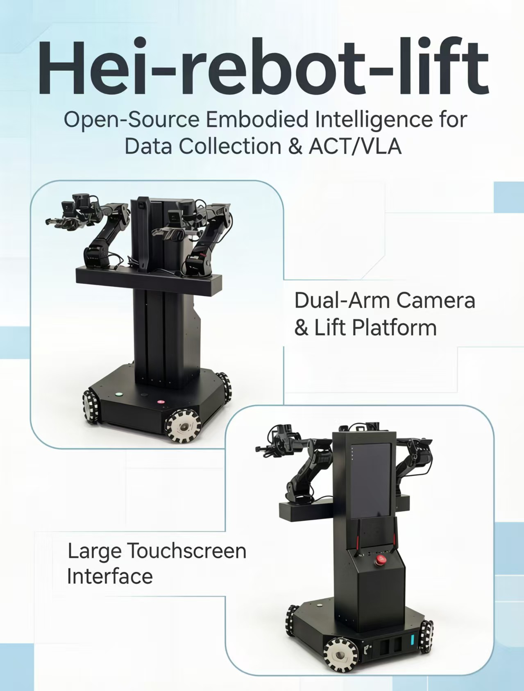

<h1 align="center">HEI ReBot Lift</h1>

<p align="center">
  
</p>

<p align="center">
  <a href="README.md"><b>English</b></a> <b>|</b>
  <a href="README_zh.md"><b>中文</b></a> <b>|</b>
  <a href="README_Fr.md"><b>français</b></a> <b>|</b>
  <a href="README_es.md"><b>Español</b></a>
</p>

<p align="center">
  <a href="https://github.com/lipengdong/hei-rebot-lift/stargazers">
    
  </a>
</p>

## 🚀 Overview

**HEI ReBot Lift** is a **dual-arm lifting mobile robot project for embodied AI learning, reproduction, and real-robot validation**. Its goal is to **lower the barrier to building real robot learning systems**. It follows the idea of **truly reproducible open source**: not only releasing code, but also organizing **hardware materials, wiring, deployment steps, the VR teleoperation pipeline, dataset recording, ACT/VLA training, and real-robot rollout workflows**, so builders can move from hardware assembly all the way to policy deployment. The robot consists of dual arms, a lift platform, a four-wheel O-type omnidirectional chassis, and three cameras. The software is built on LeRobot and covers MuJoCo/Pinocchio inverse kinematics, LeRobotDataset, imitation learning, and VLA policy deployment.

<p align="center">
  <b>🚀 Dual-Arm Mobile Manipulation</b> · <b>📖 Open Hardware + Software Stack</b> · <b>🤖 LeRobot Ready</b>
</p>

<p align="center">
  <a href="#-quick-setup">🚀 Quick Setup</a> ·
  <a href="#-hardware">🦾 Hardware</a> ·
  <a href="#-startup-flow">🎮 VR Teleoperation</a> ·
  <a href="#-record-data">📷 Record Data</a> ·
  <a href="#-train-act">🧠 Train ACT</a> ·
  <a href="#-train-smolvla">✨ Train VLA</a>
</p>

## ✨ Features

<div align="center">

<table>
  <thead>
    <tr>
      <th align="center">Icon</th>
      <th align="center">Capability</th>
      <th align="center">Description</th>
    </tr>
  </thead>
  <tbody>
    <tr><td align="center">🦾</td><td align="center">Dual-arm manipulation</td><td align="center">Damiao dual arms and grippers for teleoperation, recording, and policy rollout</td></tr>
    <tr><td align="center">⬆️</td><td align="center">Lift platform</td><td align="center">Automatic homing on startup, with the upper limit defined as <code>height.pos = 0</code></td></tr>
    <tr><td align="center">⭕</td><td align="center">Omnidirectional base</td><td align="center">Four-wheel O-type omnidirectional chassis with <code>x/y/theta</code> velocity control</td></tr>
    <tr><td align="center">🎮</td><td align="center">VR teleoperation</td><td align="center">Telegrip captures VR controller data; MuJoCo + Pinocchio/CasADi compute IK</td></tr>
    <tr><td align="center">📷</td><td align="center">Three-camera data</td><td align="center"><code>front</code>, <code>left_wrist</code>, and <code>right_wrist</code> visual inputs</td></tr>
    <tr><td align="center">🧠</td><td align="center">Imitation learning / VLA</td><td align="center">Supports LeRobotDataset, ACT, SmolVLA, and real-robot rollout</td></tr>
  </tbody>
</table>


</div>

## 🤝 Get Your Own Robot / Join the Community

If you want to reproduce your own **HEI ReBot Lift**, you can follow the hardware materials, BOM, wiring notes, and software deployment documents gradually organized in this project to source parts and build the robot yourself. We also welcome builders and researchers interested in dual-arm mobile manipulation, VR teleoperation, LeRobot data collection, ACT/VLA training, and real-robot deployment to exchange ideas with us.

If you want to **get your own robot faster**, or would like to collaborate on hardware reproduction, teaching labs, data collection, algorithm validation, or application deployment, feel free to contact us.

<p align="center">
  <b>WeChat community / collaboration:</b> <code>hgm159951</code> &nbsp;&nbsp;|&nbsp;&nbsp;
  <b>Email:</b> <a href="mailto:hgm159951@163.com">hgm159951@163.com</a>
</p>

Reproductions, discussions, issues, improvements, and real-robot test feedback are all welcome.

## 📁 Project Layout

```text
hei-rebot-lift/
├── README.md
├── README_zh.md
├── README_Fr.md
├── README_es.md
├── LICENSE
├── community/                    # Community notes and collaboration records
├── hardware/                     # Hardware BOM, wiring, device binding, mechanical materials
├── media/                        # Images, videos, and README assets
├── docs/                         # Deployment and usage documentation
└── software/
    └── lerobot-hei-rebot-lift/   # Runnable LeRobot-based software project
```

The runnable software lives in:

```text
software/lerobot-hei-rebot-lift/
```

Quick Setup starts at the repository root. For later sections, open a new
terminal at the repository root for each command block; each block includes its
own `cd`. Replace `192.168.31.127` with your robot IP. The headset connects to
the **computer IP**, not the robot IP. The software directory is:

```bash
cd software/lerobot-hei-rebot-lift
```

## 🖼️ Showcase

<p align="center">
  
</p>

## ⭐ Star History

<p align="center">
  <a href="https://www.star-history.com/?repos=lipengdong%2Fhei-rebot-lift&type=date&legend=top-left">
    
  </a>
</p>

## 🗺️ Roadmap & Latest Status

We will continue improving HEI ReBot Lift across hardware materials, software interfaces, data collection workflows, and mainstream embodied AI policy integrations. The table below summarizes the current status and links to the related documentation.

| Module | Status | Current Progress | Related DOC |
| --- | --- | --- | --- |
| Robot body | ✅ First version completed | Dual arms, lift platform, and four-wheel O-type omnidirectional base are integrated and tested as a complete system | [Hardware](hardware/README.md) |
| Complete robot URDF | ✅ Completed | Full robot model includes the chassis, wheels, lift, dual arms, parallel grippers, and TCP frames for simulation and real-robot IK | [URDF Model](software/lerobot-hei-rebot-lift/examples/hei_rebot_lift/VR_mujoco_ik/mujoco_ik/model/HEI_robot_urdf/) |
| MuJoCo simulation testing | ✅ Completed | VR control of both arms, grippers, lift, and chassis has been tested; includes wheel animations, workspace projection, and stable-grasp pick-and-place demonstrations | [Simulation Guide](software/lerobot-hei-rebot-lift/examples/hei_rebot_lift/VR_mujoco_ik/README.md) |
| Damiao motor driver | ✅ First version completed | `damiao_u2can` is implemented for dual arms, grippers, chassis, and lift motor control | [Damiao U2CAN](software/lerobot-hei-rebot-lift/src/lerobot/motors/damiao_u2can/) |
| Lift platform | ✅ First version completed | Supports upper-limit homing on startup and `height.pos` position-target control | [Robot Driver](software/lerobot-hei-rebot-lift/src/lerobot/robots/hei_rebot_lift/README.md) · [Independent Lift Control](software/lerobot-hei-rebot-lift/examples/hei_rebot_lift/README.md#independent-lift-test) |
| Omnidirectional base | ✅ First version completed | Supports `x.vel`, `y.vel`, and `theta.vel` commands with basic acceleration smoothing | [Robot Driver](software/lerobot-hei-rebot-lift/src/lerobot/robots/hei_rebot_lift/README.md) · [Independent Chassis Control](software/lerobot-hei-rebot-lift/examples/hei_rebot_lift/README.md#independent-chassis-test) |
| Three-camera vision | ✅ First version completed | Supports `front`, `left_wrist`, and `right_wrist` OpenCV cameras with MJPG by default | [Robot Driver](software/lerobot-hei-rebot-lift/src/lerobot/robots/hei_rebot_lift/README.md) |
| VR + MuJoCo IK | ✅ First version completed | Telegrip + MuJoCo + Pinocchio/CasADi is connected to the real-robot control pipeline | [VR MuJoCo IK](software/lerobot-hei-rebot-lift/examples/hei_rebot_lift/VR_mujoco_ik/README.md) |
| LeRobot integration | ✅ First version completed | `hei_rebot_lift` robot/client/host is implemented with teleoperate, record, replay, evaluate, and rollout scripts | [Examples](software/lerobot-hei-rebot-lift/examples/hei_rebot_lift/README.md) |
| Data collection | ✅ First version completed | Supports LeRobotDataset recording, resume recording, visualization, and bad-episode cleanup | [Record Guide](software/lerobot-hei-rebot-lift/examples/hei_rebot_lift/README.md) |
| ACT training and rollout | ✅ Verified | Supports ACT training and real-robot rollout | [Examples](software/lerobot-hei-rebot-lift/examples/hei_rebot_lift/README.md) |
| SmolVLA / VLA | ✅ Initial support | Supports SmolVLA training and real-robot rollout entry points | [Examples](software/lerobot-hei-rebot-lift/examples/hei_rebot_lift/README.md) |
| Open hardware materials | ✅ Completed | Overall BOM, full robot STEP assembly, printed-part STL files, metal parts list, and STEP/DWG manufacturing files are available | [Hardware](hardware/README.md) |
| Community and reproduction | 🚧 Ongoing | WeChat group, email contact, and GitHub project entry are available | [Community](community/README.md) |
| Other mainstream VLA deployment reproduction | ⏳ Coming soon | Plan to reproduce and test more mainstream VLA policies for training, inference, and real-robot deployment on HEI ReBot Lift | Not completed |

## 🦾 Hardware

The hardware package now includes the overall BOM, full robot STEP assembly, 3D printed parts, and metal/CNC/sheet-metal manufacturing files.

| Resource | File / Directory | Description |
| --- | --- | --- |
| Hardware guide | [hardware/README.md](hardware/README.md) | Hardware directory index, reproduction order, and safety checklist |
| Overall BOM V1.1 | [hardware/HEI_ReBot_Lift_BOM.md](hardware/HEI_ReBot_Lift_BOM.md) / [xlsx](hardware/HEI_ReBot_Lift_BOM.xlsx) | Main purchasing and preparation checklist; verify current prices before purchase |
| Full robot assembly | [hardware/Hei_robot_lift.STEP](hardware/Hei_robot_lift.STEP) | Full STEP model for structure review and assembly reference |
| 3D printed parts | [hardware/3D_Printed_Parts/](hardware/3D_Printed_Parts/) | STL files for printed covers, brackets, lift, chassis, and camera-related parts |
| Metal body parts list | [hardware/Metal_Parts/HEI_Metal_Body_Parts_List.xlsx](hardware/Metal_Parts/HEI_Metal_Body_Parts_List.xlsx) | Metal/CNC/sheet-metal part list |
| Metal CAD files | [hardware/Metal_Parts/step/](hardware/Metal_Parts/step/) / [hardware/Metal_Parts/dwg/](hardware/Metal_Parts/dwg/) | STEP and DWG files for machining communication |

### Assembly and Debugging Tutorial

Scan the QR code for the HEI ReBot Lift assembly and debugging tutorial. Use it
together with the repository BOM, latest CAD files, and safety checklist.

<p align="center">
  <a href="media/hei-rebot-lift-assembly-debugging-tutorial.png"></a>
  <br>
  <em>Scan to open the assembly and debugging tutorial.</em>
</p>

```text
Dual arms: left and right arms with 7 Damiao motors each. Joints 1-3 use DM4340P, joints 4-6 and gripper use DM4310
Chassis: four-wheel O-type omnidirectional mobile base, using DM4310 wheel motors
Lift: lead-screw lift platform using a DM4310 motor. On startup, the upper limit is homed as height.pos = 0
Cameras: three OpenCV cameras: front, left_wrist, right_wrist
Communication: ZMQ between robot-side host and computer-side client
Teleoperation: VR headset and controllers. Telegrip captures VR data; MuJoCo + Pinocchio/CasADi compute IK
```

## 🧩 Software Modules

```text
software/lerobot-hei-rebot-lift/src/lerobot/robots/hei_rebot_lift/        Robot driver
software/lerobot-hei-rebot-lift/src/lerobot/motors/damiao_u2can/          Damiao U2CAN communication
software/lerobot-hei-rebot-lift/examples/hei_rebot_lift/                  Record, replay, evaluate, and rollout scripts
software/lerobot-hei-rebot-lift/examples/hei_rebot_lift/VR_mujoco_ik/     VR + MuJoCo + Pinocchio IK
```

## ⚡ Quick Setup

Both machines need this project's code, but their dependencies and roles differ.
**Start each subsection at the repository root on the specified machine. Do not
execute robot-side and computer-side steps consecutively on one machine.**

| Machine | Environment | Purpose |
| --- | --- | --- |
| Robot-side Jetson | `lerobot5` | Hardware drivers, serial binding, robot host; no VR/IK environment needed |
| Your computer: control/training | `lerobot5` | Teleoperation client, dataset recording/editing, visualization, training, policy inference |
| Your computer: VR/simulation | `hei-rebot-vr` | Telegrip, MuJoCo, Pinocchio/CasADi FK/IK |

### 1. Robot-Side Jetson Installation

**Run only on the robot.** Install the hardware extras without the computer-side
dataset visualization and training extras. This still includes the project's
base dependencies; it is not a standalone driver package without PyTorch.

```bash
cd software/lerobot-hei-rebot-lift
conda create -n lerobot5 python=3.12 -y
conda activate lerobot5
python -m pip install -e ".[hardware,pyzmq-dep]"
python -c "import serial, zmq, cv2; print('robot dependencies ok')"
```

If a working `lerobot5` environment already exists, skip creation and activate
it before installation. For Jetson PyTorch/torchvision platform or version
conflicts, account for the installed JetPack and this project's version
constraints. Do not copy desktop CUDA wheels or bypass all dependencies with
`--no-deps`.

Next, follow Device Mapping below, verify limit switches and cameras, then start
`hei-rebot-lift-host` using Startup Flow. Do not create `hei-rebot-vr` on the robot.

### 2. Your Computer: Control, Recording, and Training

**Run only on your computer.** This environment runs `teleoperate.py`,
`record.py`, training, replay, and policy inference; it does not directly open
the robot's motor serial ports.

```bash
cd software/lerobot-hei-rebot-lift
conda create -n lerobot5 python=3.12 -y
conda activate lerobot5
python -m pip install -e ".[core_scripts,training,pyzmq-dep]"
python -m pip show pyzmq rerun-sdk pynput datasets accelerate
```

This includes dataset recording/editing, Rerun visualization, keyboard input,
ZMQ, and general training dependencies. Install SmolVLA-specific dependencies
in its training section below. Skip creation if `lerobot5` already exists.

### 3. Your Computer: VR/MuJoCo IK

On your computer, **open another terminal at the repository root**. Telegrip and
MuJoCo IK share `hei-rebot-vr`; do not mix these dependencies into `lerobot5`.
Use the conda-forge versions in `environment.yml` for FK/IK; do not separately
install `pin` with pip.

```bash
cd software/lerobot-hei-rebot-lift/examples/hei_rebot_lift/VR_mujoco_ik
conda env create -f environment.yml
conda activate hei-rebot-vr
env -u LD_LIBRARY_PATH python -c "import pinocchio as pin; from pinocchio import casadi as cpin; print(pin.__version__); print('casadi binding ok')"
```

For an existing environment, replace creation with
`conda env update -n hei-rebot-vr -f environment.yml --prune`. Launch wrappers
activate it automatically. Test pure simulation before connecting real hardware;
see the [VR deployment guide](software/lerobot-hei-rebot-lift/examples/hei_rebot_lift/VR_mujoco_ik/README.md).

## 🔌 Device Mapping

Stable udev device names are used by default:

```text
/dev/hei_right_arm   Right arm U2CAN
/dev/hei_left_arm    Left arm U2CAN
/dev/hei_chassis     Chassis U2CAN
/dev/hei_lift        Lift motor U2CAN
/dev/hei_lift_io     Lift limit-switch serial port
```

### 1. Serial Port Discovery and Binding Wizard

Run [Port_Binding_Wizard.py](software/lerobot-hei-rebot-lift/examples/hei_rebot_lift/debug/Port_Binding_Wizard.py)
on the **robot-side Jetson**. It scans `ttyACM*` / `ttyUSB*`, identifies adapters
from responding motor IDs and valid limit-switch IO frames, and generates stable
device mappings after confirmation. It does not enable motors, write zeros, or
send movement commands.

**Prepare the hardware:**

1. Stop `hei-rebot-lift-host` and all motor/serial debug programs so the ports are free.
2. Power down and support the arms before changing wiring. Temporarily disconnect **right-arm IDs 4-7**, leaving IDs 1-3 connected; keep the left arm fully connected on IDs 1-7.
3. Check chassis IDs 1-4, lift ID 1, and the lift limit-switch IO wiring. Power the four U2CAN boards, IO board, and motors needed for discovery.
4. Keep USB sockets unchanged throughout scanning and rule installation.

Set serial-port read/write permissions before running the Python wizard:

```bash
sudo chmod 666 /dev/ttyACM*
sudo chmod 666 /dev/ttyUSB*
```

Start the interactive wizard from the repository root:

```bash
cd software/lerobot-hei-rebot-lift
PYTHONPATH=src conda run --no-capture-output -n lerobot5 \
  python -u examples/hei_rebot_lift/debug/Port_Binding_Wizard.py
```

Review the scan, confirm the arm/chassis/lift/IO mapping, and choose whether to
install the system rules. The default output is
`examples/hei_rebot_lift/rules/99-nx-robot.rules`, with an existing-file backup.
Installation into `/etc/udev/rules.d/` requires `sudo`; the wizard reloads rules
and checks symlinks. Existing lidar and IMU rules are preserved; those devices
are not identified by this scan.

**Verify the bindings:**

```bash
ls -l /dev/hei_right_arm /dev/hei_left_arm /dev/hei_chassis /dev/hei_lift /dev/hei_lift_io
```

If a symlink is missing, reconnect that USB device to the same socket and check
again. After verification, power down, reconnect right-arm IDs 4-7, and power up
before independent hardware tests below. Rules follow physical USB topology: keep each adapter
in its original socket, and rebind after changing sockets or hubs.

For missing/ambiguous devices, busy ports, or invalid IO frames, check power,
USB/CAN wiring, motor IDs, competing processes, and the IO baud rate before
accepting any mapping. For permission errors, check serial access (usually the
`dialout` group). Use interactive mode for first deployment; `--yes --install`
is only for repeat binding with verified wiring and an unambiguous scan.

### 2. After Binding: Arm Zeros and Independent Hardware Tests

**Run all tests on the robot-side Jetson; no VR or computer client is needed.**
Run one debug tool at a time with the host and other serial programs stopped.
Each block starts in a new terminal at the repository root. For keyboard tools,
activate `lerobot5` and run Python directly in an interactive terminal; allocate
a TTY for SSH (for example, `ssh -t USER@ROBOT_IP`). Dashboards refresh in place.
Keep the physical emergency stop reachable; software stop keys do not replace it.

#### 2.1 Position the Arm at Its Designed Mechanical Zero Before Writing

**Warning: `Arm_Zero_Status_Test.py` immediately disables and writes zeros to
all seven motors (IDs 1-7) on that arm. It has no confirmation or read-only mode.
Do not start it at an arbitrary pose or use it for routine status inspection.**
Support the arms before disabling motors, as they can fall under gravity.

Use the assembly design and joint-zero definitions in the
[complete URDF model](software/lerobot-hei-rebot-lift/examples/hei_rebot_lift/VR_mujoco_ik/mujoco_ik/model/HEI_robot_urdf/)
to position the arm at its mechanical zero, not the VR controller's default
working pose. The physical gripper zero is closed (`0 rad`); do not force it
against its stop. The script cannot verify the pose. If the designed zero is
unclear, check the assembly references before writing anything.

<p align="center">
  <a href="media/arm_zero.png"></a>
  <br>
  <em>Designed mechanical zero posture reference. Verify each joint against the assembly design before writing zeros; this is not the VR working pose.</em>
</p>

Write the right-arm zeros:

```bash
cd software/lerobot-hei-rebot-lift
conda activate lerobot5
PYTHONPATH=src python -u examples/hei_rebot_lift/debug/Arm_Zero_Status_Test.py \
  --port /dev/hei_right_arm
```

Exit with `Ctrl+C`, correctly position the left arm, and then run:

```bash
cd software/lerobot-hei-rebot-lift
conda activate lerobot5
PYTHONPATH=src python -u examples/hei_rebot_lift/debug/Arm_Zero_Status_Test.py \
  --port /dev/hei_left_arm
```

The script keeps motors disabled after writing and refreshes
`POS/VEL/TORQUE/ERROR`. Verify all seven motors are connected and responding
before checking positions near zero. A displayed zero alone does not establish
connectivity or successful calibration. Interpret `ERROR` according to the motor
protocol; not every nonzero state is a fault. Exit after calibration; rewrite
zeros only when assembly or maintenance requires recalibration.

#### 2.2 Independent Chassis Test: Directions, Gears, and Wheel Feedback

Secure the chassis with wheels off the ground, clear of cables and people.
This tool connects only the chassis, not the arms, lift, or cameras.
**All four wheels move through chassis kinematics; this is not single-wheel jog.**

```bash
cd software/lerobot-hei-rebot-lift
conda activate lerobot5
PYTHONPATH=src python -u examples/hei_rebot_lift/debug/Chassis_Status_Test.py \
  --port /dev/hei_chassis
```

| Key | Function |
| --- | --- |
| `1 / 2 / 3` | Low / medium / high gear; begin with low gear `1` |
| `W / S` | Forward / backward |
| `A / D` | Strafe left / right |
| `Q / E` | Rotate left / right |
| `Space` | Software command for zero speed on all wheels |
| `X` or `Ctrl+C` | Exit and stop the chassis |

Hold or repeat a direction key to maintain motion; the default key watchdog
clears the request after `0.65 s` without another direction event. Test each
direction briefly while observing requested/reconstructed body velocity and
each wheel's target/measured angular velocity, position, torque, and state code.
Body velocities use driver command units, not directly measured meters/second.

| Motor ID | Wheel position | Dashboard label |
| --- | --- | --- |
| `1` | Right front | `RF` |
| `2` | Right rear | `RR` |
| `3` | Left rear | `LR` |
| `4` | Left front | `LF` |

Stop for a stationary wheel, incorrect mapping, missing feedback, or abnormal
shaking; check IDs, wiring, and configuration rather than increasing speed.
After the suspended test passes, verify physical directions at low gear in a
clear area. Single-wheel jogging needs a separate mode not provided by this
tool; never substitute the arm zero-writing script on the chassis port.

#### 2.3 Independent Lift Test: Homing, Height, and Limit IO

**Startup automatically homes upward.** Check both limit-switch connections and
clear the travel path first. Support structures that could fall when disabled
and keep the emergency stop ready. This tool reuses production lift logic and
opens only the lift motor and limit IO ports.

```bash
cd software/lerobot-hei-rebot-lift
conda activate lerobot5
PYTHONPATH=src python -u examples/hei_rebot_lift/debug/Lift_Status_Test.py \
  --motor-port /dev/hei_lift --io-port /dev/hei_lift_io --height-step-mm 2
```

| Key | Function |
| --- | --- |
| `I / K` | Raise / lower target height; this example changes it by `2 mm` per key event |
| `Space` | Stop and use current reported height as the hold target |
| `H` | Home upward again, only with a safe travel path |
| `X` or `Ctrl+C` | Exit, stop, and disable |

Upper-limit homing defines `0 mm`; downward heights are negative, within
`-800..0 mm`. Move down and up in small steps while checking current/target
height, error, measured speed, motor command speed, IO freshness, and limits.
Confirm the relevant IO state at a known limit. Stop for offline IO, both limits
active, or incorrect states; investigate before retrying rather than repeatedly
driving into end stops.

**Finish all independent tests and exit the debug tools** before the simulation
practice and real startup below. Never let a debug tool compete with the host
for a serial port.

### 3. Camera Mapping

Default cameras (verify actual devices on the **robot**, not your computer):

```text
front       /dev/video0
left_wrist  /dev/video2
right_wrist /dev/video4
```

Find connected cameras:

```bash
cd software/lerobot-hei-rebot-lift
PYTHONPATH=src conda run --no-capture-output -n lerobot5 lerobot-find-cameras
```

### Where to Change Camera IDs

On the **robot-side Jetson**, stop the host and camera discovery tool, then edit
[config_hei_rebot_lift.py](software/lerobot-hei-rebot-lift/src/lerobot/robots/hei_rebot_lift/config_hei_rebot_lift.py), in
`hei_rebot_lift_cameras_config()`. From the software directory, the path is
`src/lerobot/robots/hei_rebot_lift/config_hei_rebot_lift.py`.

Use the captured images in `outputs/captured_images` to identify the front,
left wrist, and right wrist cameras. Replace each camera's `index_or_path`
with its actual device path; the following values are examples, not fixed IDs:

```python
def hei_rebot_lift_cameras_config() -> dict[str, CameraConfig]:
    return {
        "front": OpenCVCameraConfig(index_or_path="/dev/video0", fps=30, width=640, height=480, fourcc="MJPG"),
        "left_wrist": OpenCVCameraConfig(index_or_path="/dev/video2", fps=30, width=640, height=480, fourcc="MJPG"),
        "right_wrist": OpenCVCameraConfig(index_or_path="/dev/video4", fps=30, width=640, height=480, fourcc="MJPG"),
    }
```

Keep the names `front`, `left_wrist`, and `right_wrist` unchanged: datasets,
policies, and clients use these keys. Leave the other settings intact when
only changing IDs; do not edit `camera_opencv.py` or the VR YAML for USB IDs.
Restart `hei-rebot-lift-host` after saving. If the client runs on another
computer, keep the same camera keys and image dimensions in its configuration;
the hardware device paths are opened by the robot host, not the client.
Device numbers can change after reconnecting USB cameras; check again or use
a verified stable device path such as `/dev/v4l/by-id/...`.

## 🎮 Startup Flow

### Identify the Computer and Robot IPs First

The examples use your computer IP `192.168.31.245` and example robot IP
`192.168.31.127`. **If the robot address differs, replace robot addresses only;
do not replace the computer address used by the headset.**

| Address | Owner | Used for |
| --- | --- | --- |
| `192.168.31.245` | Your control computer running Telegrip and MuJoCo IK | Headset browser: `https://192.168.31.245:8443` |
| `192.168.31.127` | Robot Jetson running the host | Client: `--remote-ip 192.168.31.127`; VR camera endpoint: `tcp://192.168.31.127:6556` |
| `localhost` / `127.0.0.1` | The machine running that program, not the remote robot | Local VR, action, and feedback connections when Telegrip, MuJoCo IK, and the client share one computer |

Practice in pure simulation below before real control. Simulation only needs
the computer and headset to communicate; for real control, also connect the
robot to the same mutually reachable LAN. **Run each block in a new terminal at
the repository root on the specified machine.** Keep long-running processes open.

### 1. Beginner Practice: Computer-Side Pure Simulation (No Hardware)

<p align="center">
  
</p>

Install `hei-rebot-vr` first. **Do not start the robot host, `teleoperate.py`,
`record.py`, or the real bridge during practice; stop them if already running.**
Pure simulation requires no motors, device bindings, or robot feedback and does
not publish real actions on `6558`.

#### 1.1 Computer Practice Terminal A: Start Telegrip

```bash
cd software/lerobot-hei-rebot-lift/examples/hei_rebot_lift/VR_mujoco_ik
./run_telegrip.sh
```

Connect the headset and computer to the same LAN. In the headset browser, open
`https://192.168.31.245:8443` (computer IP), verify the self-signed certificate
warning, and enter VR.

#### 1.2 Computer Practice Terminal B: Start the Complete Robot Simulation

```bash
cd software/lerobot-hei-rebot-lift/examples/hei_rebot_lift/VR_mujoco_ik
./run_hei_robot_vr_sim.sh
```

Observe the robot in the **MuJoCo window on your computer**. The scene includes
both arms, parallel grippers, lift, four-wheel omnidirectional chassis, a table,
cubes, and a banana for pick-and-place practice. Without a physical robot, no
real camera feed will appear in the headset; simulation still works.
`vr_images.enabled` is currently `false` in `telegrip/config.yaml`; leave it
disabled for practice. Changing it requires restarting Telegrip.

#### 1.3 Practice Controller Inputs in Order

<table align="center">
  <tr>
    <td align="center"><a href="media/META-QUEST-BUTTON.jpg"></a><br><b>Meta Quest System Button</b></td>
    <td align="center"><a href="media/META-GRIP-BUTTON.jpg"></a><br><b>Grip: Side Button</b></td>
    <td align="center"><a href="media/META-FRONT-TRIGGER.jpg"></a><br><b>Trigger: Front Trigger</b></td>
  </tr>
</table>

Click an image to view it at full size.

> [!IMPORTANT]
> **Calibrate the VR origin before control: hold the right controller's META QUEST BUTTON for about 3 seconds to recenter using the headset's current position and heading as the VR reference origin for this session.**
> **Recalibrate after changing your standing/seated position or operating direction. If controller motion and arm motion point in different directions or directional tracking feels wrong, stop control and recalibrate before continuing.**
> Sequence: **release both `grip` buttons → center the sticks → face the intended forward direction from your new position → hold the Meta Quest button for about 3 seconds → let tracking settle and hold `grip` again**. Verify direction with a small movement first.

The Meta Quest button recenters the **headset/VR reference frame**; `grip`
captures each arm's relative control origin. These are different operations.
Neither writes motor zeros nor replaces lift homing. Follow the calibration
procedure for both simulated and real VR control.

| Exercise | Procedure |
| --- | --- |
| Single-arm translation and rotation | Hold that side's `grip` to capture a relative origin; make small XYZ translations and rotations while observing the TCP. Practice each arm separately |
| Release and recapture the origin | Release `grip` to stop tracking, reposition the controller comfortably, then hold it again; the arm need not follow the controller back to its origin |
| Gripper pick and place | Simulation grippers start closed; real startup restores measured state. While holding `grip`, press `trigger` to open and release it to close; close near an object for stable-grasp practice, then open to place it |
| Lift | Left `grip` + left stick vertical; releasing left `grip` stops the lift request |
| Chassis | Right `grip` + right stick for forward/backward and strafing; right `B` rotates clockwise, left `Y` counterclockwise; releasing right `grip` stops the request |
| Reset | With the corresponding `grip` released, right `A` / left `X` gradually resets that arm. Focus the computer's MuJoCo window and press `R` to reset the robot and objects, in pure simulation only |

Keep sticks centered when practicing arm motion to avoid unintended chassis or
lift movement. At joint/workspace boundaries, reduce motion and return to the
reachable area instead of pushing farther out. See the
[controller tutorial](software/lerobot-hei-rebot-lift/examples/hei_rebot_lift/VR_mujoco_ik/README.md)
for complete instructions.

#### 1.4 Move to Hardware Only After Practice

- Control each arm's translation/rotation and confidently release/recapture the relative origin with `grip`.
- Recenter with the Meta Quest button and know to recalibrate after moving, changing heading, or observing a direction mismatch.
- Complete a pick-and-place exercise and understand that gripper state persists after releasing `grip`.
- Control chassis/lift directions, stop their requests, and keep sticks centered.
- Distinguish simulation and real launch scripts, locate the emergency stop, and understand real workspace hazards.

Close the pure-simulation viewer or stop it with `Ctrl+C`, then follow sections
2 and 3 below. Telegrip may stay running. If camera streaming was disabled,
restore `vr_images.enabled: true`, check the robot camera IP, and restart
Telegrip when real camera display is needed; do not launch duplicate instances.
**Simulation practice does not replace hardware safety checks.** Stable grasping
is a kinematic demonstration, not contact-physics validation. Motor directions,
zeros, limits, and load capacity still require independent verification, and
simulation lift speed can differ from real hardware.

### 2. Robot-Side Jetson: Start the Host (Terminal 1)

Run only on the robot. Complete device mapping, clear the workspace, and keep
the emergency stop reachable. Startup moves the lift upward to home;
**wait for homing to finish** before proceeding. The host runs on the robot;
it does not need the computer IP and is not the computer-side client.

```bash
cd software/lerobot-hei-rebot-lift
PYTHONPATH=src conda run --no-capture-output -n lerobot5 hei-rebot-lift-host
```

Keep this robot terminal running. Do not start Telegrip or MuJoCo IK on Jetson.

### 3. Your Computer: Start the Control Programs

Run all three programs below on **your computer** at `192.168.31.245`, not on Jetson.

#### 3.1 Start Telegrip (Computer Terminal 2)

```bash
cd software/lerobot-hei-rebot-lift/examples/hei_rebot_lift/VR_mujoco_ik
./run_telegrip.sh
```

#### 3.2 Headset Browser: Open the Computer's Page

For example, if the computer running Telegrip has LAN IP `192.168.31.245`, enter
this address in the **VR headset browser**:

```text
https://192.168.31.245:8443
```

Connect the headset and computer to the same LAN and start `run_telegrip.sh`
before opening the page. Use the **computer IP, not the robot IP**, and use
`https`. On the first visit, verify that the address belongs to your computer
before continuing past the self-signed certificate warning, then enter VR using
the page controls.

VR camera display is currently disabled. To enable it, set
`vr_images.enabled: true` and
`vr_images.endpoint: tcp://192.168.31.127:6556` in the computer's
`software/lerobot-hei-rebot-lift/examples/hei_rebot_lift/VR_mujoco_ik/telegrip/config.yaml`.
This must use the **robot IP**. Restart Telegrip after editing it; the client's
`--remote-ip` does not update this configuration.

#### 3.3 Start the Teleoperation Client (Computer Terminal 3)

Set `--remote-ip` to the **robot Jetson IP**, not the computer's `192.168.31.245`.
The client supplies robot feedback and waits for MuJoCo IK actions:

```bash
cd software/lerobot-hei-rebot-lift
PYTHONPATH=src conda run --no-capture-output -n lerobot5 python -u examples/hei_rebot_lift/teleoperate.py --remote-ip 192.168.31.127
```

#### 3.4 Start the Complete-Model Real Bridge (Computer Terminal 4)

Run on the same computer as Telegrip and the client. Default internal
connections stay local; do not replace their addresses with the robot IP:

```bash
cd software/lerobot-hei-rebot-lift/examples/hei_rebot_lift/VR_mujoco_ik
./run_hei_robot_vr_real.sh --enable-real-publish
```

With fresh robot feedback and VR data, release both grip buttons together and
wait for `command bridge ARMED`. The flag acknowledges real command publishing;
it does not bypass synchronization. For simulation only, use
`./run_hei_robot_vr_sim.sh`; the legacy dual-arm entry is `./run_mujoco_ik.sh`.
See the [VR guide](software/lerobot-hei-rebot-lift/examples/hei_rebot_lift/VR_mujoco_ik/README.md)
for controller inputs, recovery, and lift visualization limitations.

Keep **one robot-side host and three computer-side programs** running. To record
data, replace `teleoperate.py` in computer terminal 3 with `record.py`; never run
both together.

## 📷 Record Data

Stop `teleoperate.py` first. `record.py` replaces it as the action receiver and
feedback publisher; never run both together. Keep the host and Telegrip running,
then release both grips to re-arm the bridge after feedback reconnects.

```bash
cd software/lerobot-hei-rebot-lift
PYTHONPATH=src conda run --no-capture-output -n lerobot5 python -u examples/hei_rebot_lift/record.py   --repo-id HGM/hei_rebot_lift_task1   --remote-ip 192.168.31.127   --num-episodes 5   --episode-time-sec 120   --reset-time-sec 30   --task-description "Pick up the yellow block from the floor and put it on the table in front"
```

By default, data is saved locally and is not pushed to the Hugging Face Hub. Add `--push-to-hub` when uploading is needed.

## 🧠 Train ACT

Train on your computer; no robot host or VR process is required. Use the actual
dataset path printed during recording. If you chose a custom `--root`, also pass
`--dataset.root=YOUR_DATASET_PATH`; the dataset ID must match. These short runs
are smoke tests, not a guarantee of a deployable policy.

```bash
cd software/lerobot-hei-rebot-lift
PYTHONPATH=src conda run --no-capture-output -n lerobot5 lerobot-train   --dataset.repo_id=HGM/hei_rebot_lift_task1   --policy.type=act   --policy.device=cuda   --policy.push_to_hub=false   --output_dir=outputs/train/act_hei_rebot_lift_task1   --job_name=act_hei_rebot_lift_task1   --batch_size=8   --steps=10000   --save_freq=10000   --log_freq=200   --num_workers=4   --wandb.enable=false
```

## ✨ Train SmolVLA

Install the policy-specific dependencies first (new terminal at repository root):

```bash
cd software/lerobot-hei-rebot-lift
conda run --no-capture-output -n lerobot5 python -m pip install -e ".[smolvla]"
```

The general `training` extra does not install every VLA policy's dependencies.

```bash
cd software/lerobot-hei-rebot-lift
PYTHONPATH=src conda run --no-capture-output -n lerobot5 lerobot-train   --dataset.repo_id=HGM/hei_rebot_lift_task1   --policy.type=smolvla   --policy.device=cuda   --policy.push_to_hub=false   --output_dir=outputs/train/smolvla_hei_rebot_lift_task1   --job_name=smolvla_hei_rebot_lift_task1   --batch_size=1   --steps=1000   --save_freq=1000   --log_freq=50   --num_workers=2   --wandb.enable=false
```

## 🤖 Real-Robot Rollout

Keep the robot host running, but stop VR command publishing and any teleoperation,
recording, or replay process first. Use only one robot command source. Confirm the
checkpoint exists and camera names match the training data; start with a clear
workspace and a short test.

ACT rollout:

```bash
cd software/lerobot-hei-rebot-lift
PYTHONPATH=src conda run --no-capture-output -n lerobot5 python -u examples/hei_rebot_lift/rollout.py   --remote-ip 192.168.31.127   --model-id outputs/train/act_hei_rebot_lift_task1/checkpoints/010000/pretrained_model   --task "Pick up the yellow block from the floor and put it on the table in front"   --duration-sec 30   --inference sync
```

SmolVLA rollout:

```bash
cd software/lerobot-hei-rebot-lift
PYTHONPATH=src conda run --no-capture-output -n lerobot5 python -u examples/hei_rebot_lift/rollout.py   --remote-ip 192.168.31.127   --model-id outputs/train/smolvla_hei_rebot_lift_task1/checkpoints/001000/pretrained_model   --task "Pick up the yellow block from the floor and put it on the table in front"   --duration-sec 60   --fps 10   --inference rtc
```

## 📖 More Documentation

- [Documentation index](docs/README.md)
- [Recording, resume, training, and rollout](software/lerobot-hei-rebot-lift/examples/hei_rebot_lift/README.md)
- [Robot configuration, lift units, and watchdog](software/lerobot-hei-rebot-lift/src/lerobot/robots/hei_rebot_lift/README.md)
- [VR deployment, controller tutorial, and self-checks](software/lerobot-hei-rebot-lift/examples/hei_rebot_lift/VR_mujoco_ik/README.md)

## 🙏 References & Acknowledgments

The development of HEI ReBot Lift benefits from several excellent open-source projects and community efforts. In particular, we would like to thank:

- **LeRobot**: for providing a unified robot interface, the LeRobotDataset format, training utilities, and policy implementations such as ACT and SmolVLA, which form a strong foundation for real-robot data collection, training, and deployment.
- **reBot / reBot-DevArm**: for open robotic arm hardware, model resources, and practical references for embodied AI open-source projects. It also inspired the way this project organizes hardware materials, deployment documentation, and reproducible workflows.

This project customizes and extends ideas from these open-source ecosystems, aiming to further lower the barrier to learning, reproducing, collecting data with, and deploying policies on a dual-arm lifting mobile robot.

## 📄 License

This project is built on top of Hugging Face LeRobot and keeps the LeRobot dataset, training, policy, and robot-interface ecosystem. Please also follow the original LeRobot license requirements.
