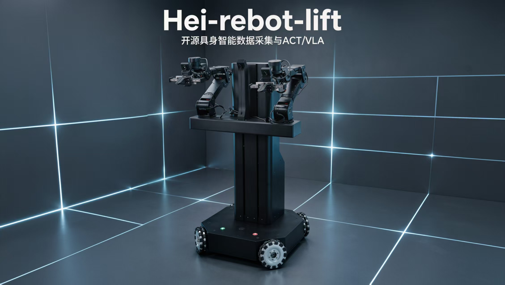
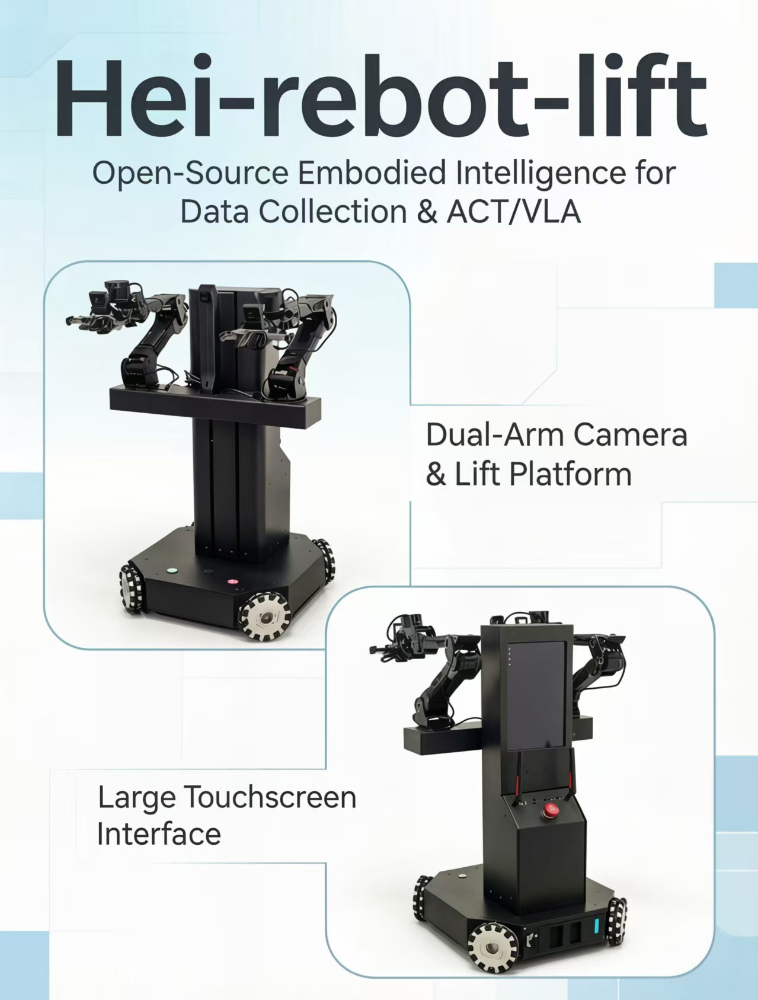

<h1 align="center">HEI ReBot Lift</h1>

<p align="center">
  
</p>

<p align="center">
  <a href="README.md"></a>
  <a href="README_en.md"></a>
</p>

## 🚀 Overview

**HEI ReBot Lift** is a dual-arm lifting mobile robot project for **embodied AI learning, reproduction, and real-robot validation**. Its goal is to **lower the barrier to building a real robot learning system**.

We focus on **truly reproducible open source**: not only code, but also **hardware materials, wiring, deployment steps, the VR teleoperation pipeline, dataset recording, ACT/VLA training, and real-robot rollout workflows**. The robot combines **dual arms, a lead-screw lift platform, a four-wheel O-type omnidirectional chassis, and three cameras**. The software is built on **LeRobot** and covers **MuJoCo/Pinocchio inverse kinematics, LeRobotDataset, imitation learning, and VLA policy deployment**.

<p align="center">
  <b>🚀 Dual-Arm Mobile Manipulation</b> · <b>📖 Open Hardware + Software Stack</b> · <b>🤖 LeRobot Ready</b>
</p>

<p align="center">
  <a href="#-quick-setup">🚀 Quick Setup</a> ·
  <a href="#-hardware">🦾 Hardware</a> ·
  <a href="#-startup-flow">🎮 VR Teleoperation</a> ·
  <a href="#-record-data">📷 Record Data</a> ·
  <a href="#-train-act">🧠 Train ACT</a> ·
  <a href="#-train-smolvla">✨ Train VLA</a>
</p>

## ✨ Features

<div align="center">

<table>
  <thead>
    <tr>
      <th align="center">Icon</th>
      <th align="center">Capability</th>
      <th align="center">Description</th>
    </tr>
  </thead>
  <tbody>
    <tr><td align="center">🦾</td><td align="center">Dual-arm manipulation</td><td align="center">Damiao dual arms and grippers for teleoperation, recording, and policy rollout</td></tr>
    <tr><td align="center">⬆️</td><td align="center">Lift platform</td><td align="center">Automatic homing on startup, with the upper limit defined as <code>height.pos = 0</code></td></tr>
    <tr><td align="center">⭕</td><td align="center">Omnidirectional base</td><td align="center">Four-wheel O-type omnidirectional chassis with <code>x/y/theta</code> velocity control</td></tr>
    <tr><td align="center">🎮</td><td align="center">VR teleoperation</td><td align="center">Telegrip captures VR controller data; MuJoCo + Pinocchio/CasADi compute IK</td></tr>
    <tr><td align="center">📷</td><td align="center">Three-camera data</td><td align="center"><code>front</code>, <code>left_wrist</code>, and <code>right_wrist</code> visual inputs</td></tr>
    <tr><td align="center">🧠</td><td align="center">Imitation learning / VLA</td><td align="center">Supports LeRobotDataset, ACT, SmolVLA, and real-robot rollout</td></tr>
  </tbody>
</table>


</div>

## 🤝 Get Your Own Robot / Join the Community

If you want to reproduce your own **HEI ReBot Lift**, you can follow the hardware materials, BOM, wiring notes, and software deployment documents gradually organized in this project to source parts and build the robot yourself. We also welcome builders and researchers interested in dual-arm mobile manipulation, VR teleoperation, LeRobot data collection, ACT/VLA training, and real-robot deployment to exchange ideas with us.

If you want to **get your own robot faster**, or would like to collaborate on hardware reproduction, teaching labs, data collection, algorithm validation, or application deployment, feel free to contact us.

<p align="center">
  <b>WeChat community / collaboration:</b> <code>hgm159951</code> &nbsp;&nbsp;|&nbsp;&nbsp;
  <b>Email:</b> <a href="mailto:hgm159951@163.com">hgm159951@163.com</a>
</p>

Reproductions, discussions, issues, improvements, and real-robot test feedback are all welcome.

## 📁 Project Layout

```text
hei-rebot-lift/
├── README.md
├── README_en.md
├── LICENSE
├── community/                    # Community notes and collaboration records
├── hardware/                     # BOM, wiring, device binding, mechanical materials
├── media/                        # Images, videos, and README assets
├── docs/                         # Deployment and usage documentation
└── software/
    └── lerobot-hei-rebot-lift/   # Runnable LeRobot-based software project
```

The runnable software lives in:

```text
software/lerobot-hei-rebot-lift/
```

All commands below assume you first enter this directory:

```bash
cd software/lerobot-hei-rebot-lift
```

## 🖼️ Showcase

<p align="center">
  
</p>

## 🦾 Hardware

```text
Dual arms: left and right arms with 7 Damiao motors each. Joints 1-3 use DM4340, joints 4-6 and gripper use DM4310
Chassis: four-wheel O-type omnidirectional mobile base
Lift: lead-screw lift platform. On startup, the upper limit is homed as height.pos = 0
Cameras: three OpenCV cameras: front, left_wrist, right_wrist
Communication: ZMQ between robot-side host and computer-side client
Teleoperation: VR headset and controllers. Telegrip captures VR data; MuJoCo + Pinocchio/CasADi compute IK
```

## 🧩 Software Modules

```text
software/lerobot-hei-rebot-lift/src/lerobot/robots/hei_rebot_lift/        Robot driver
software/lerobot-hei-rebot-lift/src/lerobot/motors/damiao_u2can/          Damiao U2CAN communication
software/lerobot-hei-rebot-lift/examples/hei_rebot_lift/                  Record, replay, evaluate, and rollout scripts
software/lerobot-hei-rebot-lift/examples/hei_rebot_lift/VR_mujoco_ik/     VR + MuJoCo + Pinocchio IK stack
```

## ⚡ Quick Setup

Create the LeRobot environment:

```bash
cd software/lerobot-hei-rebot-lift
conda create -n lerobot5 python=3.12 -y
conda activate lerobot5
pip install -e .
```

Create the VR/MuJoCo IK environment:

```bash
cd software/lerobot-hei-rebot-lift/examples/hei_rebot_lift/VR_mujoco_ik
conda env create -f environment.yml
```

Verify Pinocchio + CasADi:

```bash
conda activate hei-rebot-vr
env -u LD_LIBRARY_PATH python -c "import pinocchio as pin; from pinocchio import casadi as cpin; print(pin.__version__); print('casadi binding ok')"
```

## 🔌 Device Mapping

Stable udev device names are used by default:

```text
/dev/hei_right_arm   Right arm U2CAN
/dev/hei_left_arm    Left arm U2CAN
/dev/hei_chassis     Chassis U2CAN
/dev/hei_lift        Lift motor U2CAN
/dev/hei_lift_io     Lift limit-switch serial port
```

Default cameras:

```text
front       /dev/video0
left_wrist  /dev/video2
right_wrist /dev/video4
```

Find connected cameras:

```bash
cd software/lerobot-hei-rebot-lift
PYTHONPATH=src conda run --no-capture-output -n lerobot5 lerobot-find-cameras
```

## 🎮 Startup Flow

Start the robot-side host:

```bash
cd software/lerobot-hei-rebot-lift
PYTHONPATH=src conda run --no-capture-output -n lerobot5 hei-rebot-lift-host
```

Start Telegrip on the computer:

```bash
cd software/lerobot-hei-rebot-lift/examples/hei_rebot_lift/VR_mujoco_ik
./run_telegrip.sh
```

Open this URL in the VR headset browser:

```text
https://COMPUTER_IP:8443
```

Start MuJoCo IK on the computer:

```bash
cd software/lerobot-hei-rebot-lift/examples/hei_rebot_lift/VR_mujoco_ik
./run_mujoco_ik.sh
```

Test teleoperation:

```bash
cd software/lerobot-hei-rebot-lift
PYTHONPATH=src conda run --no-capture-output -n lerobot5 python -u examples/hei_rebot_lift/teleoperate.py --remote-ip 192.168.31.127
```

## 📷 Record Data

```bash
cd software/lerobot-hei-rebot-lift
PYTHONPATH=src conda run --no-capture-output -n lerobot5 python -u examples/hei_rebot_lift/record.py   --repo-id HGM/hei_rebot_lift_task1   --remote-ip 192.168.31.127   --num-episodes 5   --episode-time-sec 120   --reset-time-sec 30   --task-description "Pick up the yellow block from the floor and put it on the table in front"
```

By default, data is saved locally and is not pushed to the Hugging Face Hub. Add `--push-to-hub` when uploading is needed.

## 🧠 Train ACT

```bash
cd software/lerobot-hei-rebot-lift
PYTHONPATH=src conda run --no-capture-output -n lerobot5 lerobot-train   --dataset.repo_id=HGM/hei_rebot_lift_task1   --policy.type=act   --policy.device=cuda   --policy.push_to_hub=false   --output_dir=outputs/train/act_hei_rebot_lift_task1   --job_name=act_hei_rebot_lift_task1   --batch_size=8   --steps=10000   --save_freq=10000   --log_freq=200   --num_workers=4   --wandb.enable=false
```

## ✨ Train SmolVLA

```bash
cd software/lerobot-hei-rebot-lift
PYTHONPATH=src conda run --no-capture-output -n lerobot5 lerobot-train   --dataset.repo_id=HGM/hei_rebot_lift_task1   --policy.type=smolvla   --policy.device=cuda   --policy.push_to_hub=false   --output_dir=outputs/train/smolvla_hei_rebot_lift_task1   --job_name=smolvla_hei_rebot_lift_task1   --batch_size=1   --steps=1000   --save_freq=1000   --log_freq=50   --num_workers=2   --wandb.enable=false
```

## 🤖 Real-Robot Rollout

ACT rollout:

```bash
cd software/lerobot-hei-rebot-lift
PYTHONPATH=src conda run --no-capture-output -n lerobot5 python -u examples/hei_rebot_lift/rollout.py   --model-id outputs/train/act_hei_rebot_lift_task1/checkpoints/010000/pretrained_model   --task "Pick up the yellow block from the floor and put it on the table in front"   --duration-sec 30   --inference sync
```

SmolVLA rollout:

```bash
cd software/lerobot-hei-rebot-lift
PYTHONPATH=src conda run --no-capture-output -n lerobot5 python -u examples/hei_rebot_lift/rollout.py   --model-id outputs/train/smolvla_hei_rebot_lift_task1/checkpoints/001000/pretrained_model   --task "Pick up the yellow block from the floor and put it on the table in front"   --duration-sec 60   --fps 10   --inference rtc
```

## 📖 More Documentation

```text
software/lerobot-hei-rebot-lift/README.md
software/lerobot-hei-rebot-lift/examples/hei_rebot_lift/README.md
software/lerobot-hei-rebot-lift/src/lerobot/robots/hei_rebot_lift/README.md
software/lerobot-hei-rebot-lift/examples/hei_rebot_lift/VR_mujoco_ik/README.md
```

## 📄 License

This project is built on top of Hugging Face LeRobot and keeps the LeRobot dataset, training, policy, and robot-interface ecosystem. Please also follow the original LeRobot license requirements.
