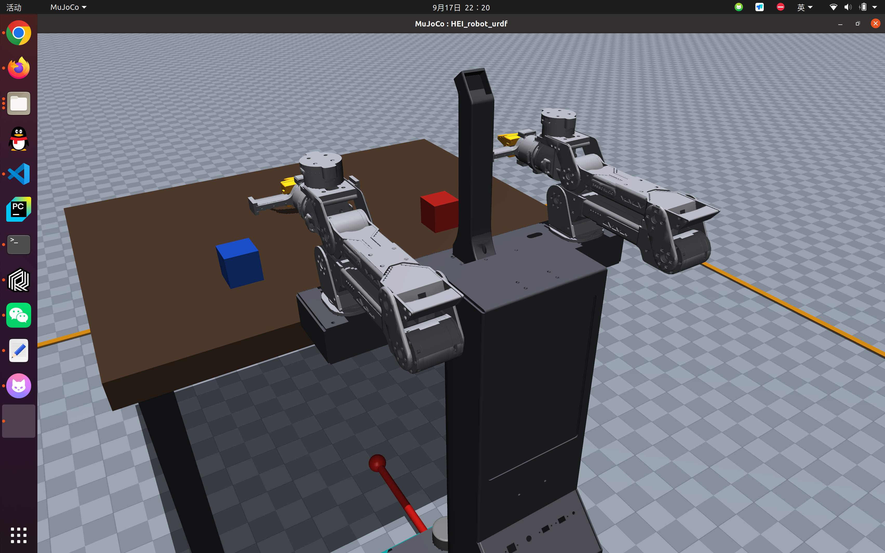
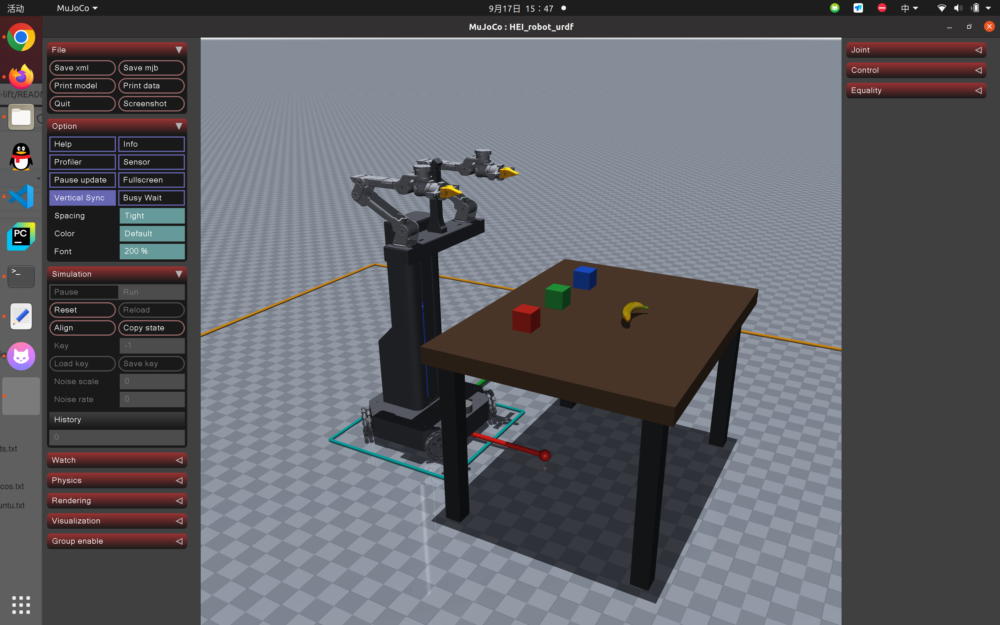
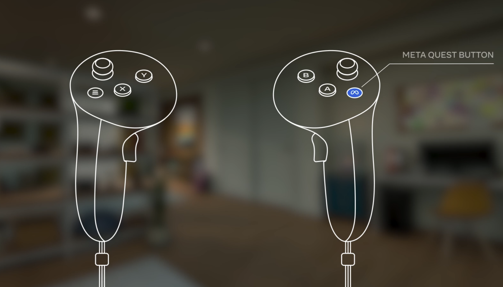
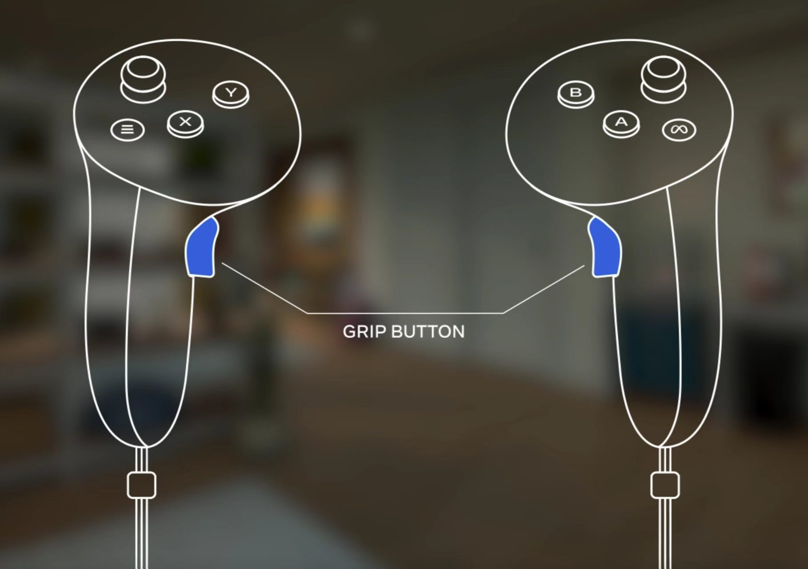
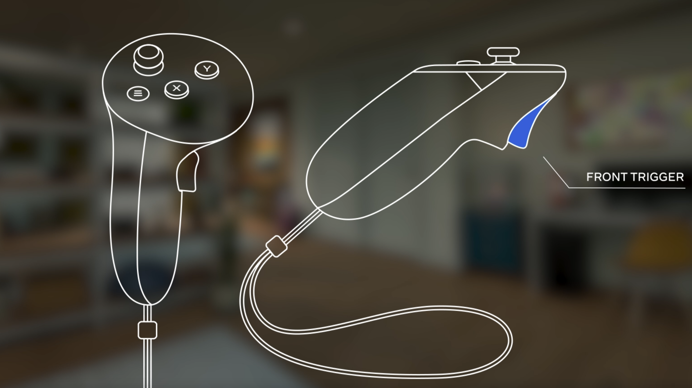

<h1 align="center">HEI ReBot Lift</h1>

<p align="center">
  
</p>

<p align="center">
  <a href="README.md"><b>English</b></a> <b>|</b>
  <a href="README_zh.md"><b>中文</b></a> <b>|</b>
  <a href="README_Fr.md"><b>français</b></a> <b>|</b>
  <a href="README_es.md"><b>Español</b></a>
</p>

<p align="center">
  <a href="https://github.com/lipengdong/hei-rebot-lift/stargazers">
    
  </a>
</p>

## 🚀 Descripción general

**HEI ReBot Lift** es un proyecto de **robot móvil con doble brazo y plataforma elevadora** para aprendizaje de IA encarnada, reproducción de hardware y validación en robot real. Su objetivo es **reducir la barrera para construir sistemas reales de aprendizaje robótico**. Sigue la idea de un **código abierto realmente reproducible**: además del código, organiza materiales de hardware, cableado, despliegue, teleoperación VR, grabación de datasets, entrenamiento ACT/VLA y rollout en robot real.

<p align="center">
  <b>🚀 Manipulación móvil de doble brazo</b> · <b>📖 Hardware + software abiertos</b> · <b>🤖 Compatible con LeRobot</b>
</p>

<p align="center">
  <a href="#-instalación-rápida">🚀 Instalación rápida</a> ·
  <a href="#-hardware">🦾 Hardware</a> ·
  <a href="#-flujo-de-arranque">🎮 Teleoperación VR</a> ·
  <a href="#-grabación-de-datos">📷 Datos</a> ·
  <a href="#-entrenamiento-act">🧠 ACT</a> ·
  <a href="#-entrenamiento-smolvla">✨ VLA</a>
</p>

## ✨ Características

<div align="center">

<table>
  <thead>
    <tr><th align="center">Icono</th><th align="center">Capacidad</th><th align="center">Descripción</th></tr>
  </thead>
  <tbody>
    <tr><td align="center">🦾</td><td align="center">Manipulación de doble brazo</td><td align="center">Brazos Damiao y pinzas para teleoperación, grabación y rollout</td></tr>
    <tr><td align="center">⬆️</td><td align="center">Plataforma elevadora</td><td align="center">Homing automático al iniciar; límite superior como <code>height.pos = 0</code></td></tr>
    <tr><td align="center">⭕</td><td align="center">Base omnidireccional</td><td align="center">Chasis omnidireccional de cuatro ruedas con control <code>x/y/theta</code></td></tr>
    <tr><td align="center">🎮</td><td align="center">Teleoperación VR</td><td align="center">Telegrip recibe datos VR; MuJoCo + Pinocchio/CasADi calculan IK</td></tr>
    <tr><td align="center">📷</td><td align="center">Tres cámaras</td><td align="center"><code>front</code>, <code>left_wrist</code> y <code>right_wrist</code></td></tr>
    <tr><td align="center">🧠</td><td align="center">Imitación / VLA</td><td align="center">Compatible con LeRobotDataset, ACT, SmolVLA y rollout real</td></tr>
  </tbody>
</table>


</div>

## 🤝 Obtén tu robot / Únete a la comunidad

Puedes reproducir tu propio **HEI ReBot Lift** usando los materiales de hardware, BOM, notas de cableado y documentación de despliegue del proyecto. También damos la bienvenida a constructores e investigadores interesados en manipulación móvil de doble brazo, teleoperación VR, recopilación de datos con LeRobot, entrenamiento ACT/VLA y despliegue en robot real.

<p align="center">
  <b>Comunidad WeChat / colaboración:</b> <code>hgm159951</code> &nbsp;&nbsp;|&nbsp;&nbsp;
  <b>Email:</b> <a href="mailto:hgm159951@163.com">hgm159951@163.com</a>
</p>

## 📁 Estructura del proyecto

```text
hei-rebot-lift/
├── README.md
├── README_zh.md
├── README_Fr.md
├── README_es.md
├── community/
├── hardware/
├── media/
├── docs/
└── software/
    └── lerobot-hei-rebot-lift/
```

El software ejecutable está en:

```bash
cd software/lerobot-hei-rebot-lift
```

## Hoja de ruta y últimos avances

La tabla resume el estado actual del proyecto y enlaza la documentación correspondiente. Las guías técnicas enlazadas están disponibles en inglés, con versiones chinas para la mayoría.

| Módulo | Estado | Avances actuales | Documentación |
| --- | --- | --- | --- |
| Estructura del robot | Primera versión completada | Doble brazo, plataforma elevadora y base omnidireccional de cuatro ruedas en configuración O integrados y probados como un sistema completo | [Hardware](hardware/README.md) |
| URDF del robot completo | Completado | Modelo del chasis, ruedas, elevador, brazos, pinzas paralelas y marcos TCP para simulación e IK en el robot real | [Modelo URDF](software/lerobot-hei-rebot-lift/examples/hei_rebot_lift/VR_mujoco_ik/mujoco_ik/model/HEI_robot_urdf/) |
| Pruebas de simulación MuJoCo | Completadas | Control VR de brazos, pinzas, elevador y chasis probado, con animación de ruedas, proyección al espacio de trabajo y demostraciones de recogida y colocación en modo de agarre estable | [Guía de simulación](software/lerobot-hei-rebot-lift/examples/hei_rebot_lift/VR_mujoco_ik/README.md) |
| Controlador de motores Damiao | Primera versión completada | `damiao_u2can` controla brazos, pinzas y motores del chasis y del elevador | [Damiao U2CAN](software/lerobot-hei-rebot-lift/src/lerobot/motors/damiao_u2can/) |
| Plataforma elevadora | Primera versión completada | Homing al límite superior al iniciar y control de posición objetivo `height.pos` | [Controlador del robot](software/lerobot-hei-rebot-lift/src/lerobot/robots/hei_rebot_lift/README.md) · [Control independiente del elevador](software/lerobot-hei-rebot-lift/examples/hei_rebot_lift/README.md#independent-lift-test) |
| Base omnidireccional | Primera versión completada | Comandos `x.vel`, `y.vel` y `theta.vel`, con suavizado de aceleración y desaceleración | [Controlador del robot](software/lerobot-hei-rebot-lift/src/lerobot/robots/hei_rebot_lift/README.md) · [Control independiente del chasis](software/lerobot-hei-rebot-lift/examples/hei_rebot_lift/README.md#independent-chassis-test) |
| Visión con tres cámaras | Primera versión completada | Cámaras OpenCV `front`, `left_wrist` y `right_wrist`, con formato MJPG por defecto | [Controlador del robot](software/lerobot-hei-rebot-lift/src/lerobot/robots/hei_rebot_lift/README.md) |
| VR e IK MuJoCo | Primera versión completada | Telegrip, MuJoCo y Pinocchio/CasADi conectados al flujo de control del robot real | [VR MuJoCo IK](software/lerobot-hei-rebot-lift/examples/hei_rebot_lift/VR_mujoco_ik/README.md) |
| Integración LeRobot | Primera versión completada | Robot, cliente y host `hei_rebot_lift`, con scripts de teleoperación, grabación, replay, evaluación y rollout | [Ejemplos](software/lerobot-hei-rebot-lift/examples/hei_rebot_lift/README.md) |
| Recopilación de datos | Primera versión completada | Grabación LeRobotDataset, reanudación, visualización y eliminación de episodios de baja calidad | [Guía de grabación](software/lerobot-hei-rebot-lift/examples/hei_rebot_lift/README.md) |
| Entrenamiento y rollout ACT | Verificados | Entrenamiento ACT y rollout en el robot real | [Ejemplos](software/lerobot-hei-rebot-lift/examples/hei_rebot_lift/README.md) |
| SmolVLA / VLA | Soporte inicial | Puntos de entrada para entrenamiento SmolVLA y rollout en el robot real | [Ejemplos](software/lerobot-hei-rebot-lift/examples/hei_rebot_lift/README.md) |
| Materiales de hardware abiertos | Completados | BOM general, ensamblaje STEP completo, piezas impresas STL, lista de piezas metálicas y archivos STEP/DWG de fabricación | [Hardware](hardware/README.md) |
| Comunidad y reproducción | En curso | Grupo WeChat, contacto por correo electrónico y repositorio GitHub disponibles | [Comunidad](community/README.md) |
| Reproducción de otros VLA populares | Próximamente | Reproducir y probar más políticas VLA para entrenamiento, inferencia y despliegue en HEI ReBot Lift | No completado |

## 🦾 Hardware

| Recurso | Archivo / Directorio | Descripción |
| --- | --- | --- |
| Guía de hardware | [hardware/README.md](hardware/README.md) | Índice, orden de reproducción y checklist de seguridad |
| BOM completo V1.1 | [hardware/HEI_ReBot_Lift_BOM.md](hardware/HEI_ReBot_Lift_BOM.md) / [xlsx](hardware/HEI_ReBot_Lift_BOM.xlsx) | Lista principal; comprobar los precios actuales antes de comprar |
| Ensamblaje completo | [hardware/Hei_robot_lift.STEP](hardware/Hei_robot_lift.STEP) | Modelo STEP completo del robot |
| Piezas 3D | [hardware/3D_Printed_Parts/](hardware/3D_Printed_Parts/) | Archivos STL |
| Lista de piezas metálicas | [hardware/Metal_Parts/HEI_Metal_Body_Parts_List.xlsx](hardware/Metal_Parts/HEI_Metal_Body_Parts_List.xlsx) | Lista CNC / chapa metálica |
| CAD metálicos | [hardware/Metal_Parts/step/](hardware/Metal_Parts/step/) / [hardware/Metal_Parts/dwg/](hardware/Metal_Parts/dwg/) | Archivos STEP y DWG |

### Tutorial de montaje y depuración

Escanee este código QR para consultar el tutorial de HEI ReBot Lift. Compruebe
también la BOM, los últimos archivos CAD y la lista de seguridad del repositorio.

<p align="center">
  <a href="media/hei-rebot-lift-assembly-debugging-tutorial.png"></a>
</p>

```text
Brazos: dos brazos, 7 motores Damiao por brazo. Articulaciones 1-3: DM4340P; articulaciones 4-6 y pinza: DM4310
Chasis: base móvil omnidireccional de cuatro ruedas, motores DM4310
Elevador: plataforma de husillo con motor DM4310, homing a height.pos = 0
Cámaras: front, left_wrist, right_wrist
Comunicación: ZMQ entre host del robot y cliente PC
Teleoperación: visor VR + controladores, Telegrip, MuJoCo, Pinocchio/CasADi
```

## ⚡ Instalación rápida

**Cada bloque empieza en un terminal nuevo desde la raíz del repositorio, en
la máquina indicada. No ejecutar todos los pasos en una sola máquina.**
`lerobot5` usa Python 3.12; `hei-rebot-vr` usa Python 3.10 según
`environment.yml`. Son entornos distintos con funciones diferentes.

### 1. Jetson del robot: controladores de hardware

```bash
cd software/lerobot-hei-rebot-lift
conda create -n lerobot5 python=3.12 -y
conda activate lerobot5
python -m pip install -e ".[hardware,pyzmq-dep]"
python -c "import serial, zmq, cv2; print('robot dependencies ok')"
```

Si el entorno existe, reutilizarlo. Las dependencias base incluyen PyTorch;
no es un paquete de hardware autónomo. Ante conflictos en Jetson, comprobar
JetPack y las restricciones PyTorch/torchvision; no copiar ruedas CUDA de PC ni
ignorar todas las dependencias con `--no-deps`. No instalar VR/IK en el robot.

### 2. Ordenador: control, datos y entrenamiento

```bash
cd software/lerobot-hei-rebot-lift
conda create -n lerobot5 python=3.12 -y
conda activate lerobot5
python -m pip install -e ".[core_scripts,training,pyzmq-dep]"
python -m pip show pyzmq rerun-sdk pynput datasets accelerate
```

Los extras incluyen herramientas de datos, Rerun, teclado, ZMQ y entrenamiento
general. SmolVLA requiere además su extra específico, indicado más abajo.

### 3. Ordenador: VR y MuJoCo IK

```bash
cd software/lerobot-hei-rebot-lift/examples/hei_rebot_lift/VR_mujoco_ik
conda env create -f environment.yml
conda activate hei-rebot-vr
env -u LD_LIBRARY_PATH python -c "import pinocchio as pin; from pinocchio import casadi as cpin; print(pin.__version__); print('casadi binding ok')"
```

Para actualizar, sustituir la creación por
`conda env update -n hei-rebot-vr -f environment.yml --prune`.
Pinocchio/CasADi/eigenpy/coal-python deben instalarse desde conda-forge según
este archivo; no instalar `pin` por separado con pip. Los scripts activan
`hei-rebot-vr` automáticamente; los de MuJoCo eliminan `LD_LIBRARY_PATH`.

## 🔌 Mapeo de dispositivos

```text
/dev/hei_right_arm   Brazo derecho U2CAN
/dev/hei_left_arm    Brazo izquierdo U2CAN
/dev/hei_chassis     Chasis U2CAN
/dev/hei_lift        Motor elevador U2CAN
/dev/hei_lift_io     Puerto serie de finales de carrera
```

### 1. Identificación y vinculación de puertos

En Jetson, detener el host y todas las herramientas serie. Apagar la alimentación
y sujetar los brazos antes de cambiar conexiones. Desconectar temporalmente los
motores **4-7 del brazo derecho** (dejar 1-3); mantener brazo izquierdo 1-7,
chasis 1-4 y elevador 1 conectados. Alimentar las cuatro U2CAN, motores e IO
durante la detección. El asistente [Port_Binding_Wizard.py](software/lerobot-hei-rebot-lift/examples/hei_rebot_lift/debug/Port_Binding_Wizard.py) no mueve motores
ni escribe ceros.

```bash
cd software/lerobot-hei-rebot-lift
PYTHONPATH=src conda run --no-capture-output -n lerobot5 python -u examples/hei_rebot_lift/debug/Port_Binding_Wizard.py
```

Confirmar los resultados antes de escribir reglas; instalación del sistema con
sudo. Conserva las reglas lidar/IMU existentes. Mantener los mismos conectores
USB, pues se vincula por topología física. Verificar los cinco enlaces, apagar
y reconectar motores derechos 4-7 antes de probar.
`--yes --install` solo para repeticiones verificadas y sin ambigüedades.

### 2. Pruebas independientes tras vincular

Detener el host, ejecutar una herramienta serie cada vez y mantener accesible
el paro de emergencia. Activar `lerobot5` y ejecutar Python directamente desde
un terminal interactivo (SSH con TTY). Detalles en el
[manual de pruebas independientes](software/lerobot-hei-rebot-lift/examples/hei_rebot_lift/README.md#1-hardware-check).

- **Ceros de los brazos:** el script deshabilita y escribe los ceros de los siete motores inmediatamente, sin confirmación. Sujetar el brazo, colocarlo en el cero mecánico de diseño y cerrar la pinza a `0 rad`; una postura VR arbitraria no es el cero. No es una herramienta de solo lectura.

<p align="center">
  <a href="media/arm_zero.png"></a>
  <br>
  <em>Referencia del cero mecánico de diseño. Verificar cada articulación según el diseño de montaje antes de escribir los ceros; no es la postura de trabajo VR.</em>
</p>

- **Elevador:** `debug/Lift_Status_Test.py --height-step-mm 2` hace homing automático hacia arriba. Verificar ambos finales de carrera. `I/K` cambia el objetivo 2 mm por evento, `Space` mantiene la altura medida, `H` repite homing y `X` sale. Rango `-800..0 mm`.
- **Chasis:** `debug/Chassis_Status_Test.py`, con ruedas sujetas y elevadas. `W/S/A/D` traslación, `Q/E` giro, `1/2/3` velocidades, `Space` velocidad cero y `X` salida. Empezar por 1. Mueve las cuatro ruedas, no ofrece control individual. IDs 1 delantera derecha, 2 trasera derecha, 3 trasera izquierda, 4 delantera izquierda; timeout de teclado 0.65 s.

### 3. Cámaras

Comprobar en el **robot**: `front=/dev/video0`, `left_wrist=/dev/video2`,
`right_wrist=/dev/video4`; perfil actual `640x480 @ 30 FPS`, `MJPG`.
Los dispositivos pueden variar. Ejecutar `lerobot-find-cameras` en el robot.
La imagen VR está desactivada actualmente, no la captura del host.

En el **Jetson del robot**, detener el host y la herramienta de búsqueda y editar
[config_hei_rebot_lift.py](software/lerobot-hei-rebot-lift/src/lerobot/robots/hei_rebot_lift/config_hei_rebot_lift.py), función
`hei_rebot_lift_cameras_config()`. Identificar las cámaras con las imágenes de
`outputs/captured_images` y cambiar los tres valores `index_or_path`.
Mantener las claves `front`, `left_wrist`, `right_wrist` y los demás ajustes;
no editar `camera_opencv.py` ni el YAML VR para estos IDs USB.
Guardar y reiniciar `hei-rebot-lift-host`. En el ordenador cliente,
mantener las mismas claves y dimensiones; el robot abre los dispositivos USB.
Comprobar los IDs de nuevo al reconectar las cámaras.
[Ejemplo de configuración](software/lerobot-hei-rebot-lift/src/lerobot/robots/hei_rebot_lift/README.md#where-to-change-camera-ids).

## 🎮 Flujo de arranque

| Dirección de ejemplo | Máquina | Uso |
| --- | --- | --- |
| `192.168.31.245` | Ordenador de control | Visor: `https://192.168.31.245:8443` |
| `192.168.31.127` | Jetson del robot | Cliente: `--remote-ip`; cámaras VR: `tcp://192.168.31.127:6556` |
| `localhost / 127.0.0.1` | Máquina que ejecuta el programa | Conexiones locales Telegrip/IK/cliente |

Sustituir cada dirección por la de su máquina. El visor usa la IP del
ordenador, **no la del robot**. Las máquinas deben comunicarse por LAN.
`--remote-ip` no modifica `telegrip/config.yaml`.

### 1. Practicar en simulación antes del robot real

<p align="center"></p>

Solo en el ordenador; **no iniciar host, teleoperate, record ni puente real**.
Terminal A:

```bash
cd software/lerobot-hei-rebot-lift/examples/hei_rebot_lift/VR_mujoco_ik
./run_telegrip.sh
```

Abrir `https://192.168.31.245:8443` en el visor; verificar la dirección antes
de aceptar el certificado autofirmado y entrar en VR. Terminal B separado:

```bash
cd software/lerobot-hei-rebot-lift/examples/hei_rebot_lift/VR_mujoco_ik
./run_hei_robot_vr_sim.sh
```

MuJoCo aparece en el ordenador: robot completo, ruedas animadas, suelo, luces,
mesa, cubos y plátano local. No publica órdenes reales por 6558.
El agarre estable vincula objetos al TCP; no valida física de contacto.
Los límites/proyecciones IK no detectan colisiones.

#### 1.1 Botones y calibración del origen

<table align="center">
  <tr>
    <td align="center"><a href="media/META-QUEST-BUTTON.jpg"></a><br>Meta Quest</td>
    <td align="center"><a href="media/META-GRIP-BUTTON.jpg"></a><br>Grip</td>
    <td align="center"><a href="media/META-FRONT-TRIGGER.jpg"></a><br>Trigger</td>
  </tr>
</table>

> [!IMPORTANT]
> **Mantener el META QUEST BUTTON del mando derecho unos 3 segundos para recentrar el marco VR con la posición y orientación actuales del visor.**
> **Recalibrar al cambiar de posición o dirección, o si el brazo y el mando no siguen la misma dirección.**
> Soltar ambos grips, centrar sticks, mirar hacia la dirección deseada, mantener el botón unos 3 segundos, esperar a estabilizar y volver a grip. Comprobar con un movimiento pequeño.

El recentrado del visor no es el origen relativo capturado por grip.
No calibra ceros de motores ni sustituye el homing del elevador.

| Entrada | Condición | Función |
| --- | --- | --- |
| Grip izquierdo/derecho | Mantenido | Control relativo del brazo correspondiente, traslación y rotación a escala 1:1 dentro del espacio alcanzable |
| Trigger | Grip correspondiente mantenido | Pulsar para abrir, soltar para cerrar; soltar grip conserva el último estado de la pinza |
| Stick izquierdo vertical | Grip izquierdo mantenido | Hacia delante para subir, hacia atrás para bajar |
| Stick derecho | Grip derecho mantenido | Avance/retroceso y desplazamiento lateral |
| B derecho / Y izquierdo | Grip derecho mantenido | Giro horario / antihorario |
| A derecho / X izquierdo | Grip correspondiente soltado | Retorno gradual del brazo a la postura predeterminada |
| F / R en MuJoCo | Ventana activa | Marcos / reinicio de simulación; R está desactivado en modo real |

Soltar grip derecho/izquierdo anula la solicitud del chasis/elevador; el frenado
real depende del hardware. Practicar brazos, pinzas, recentrado y parada.
Cerrar la simulación antes de continuar; Telegrip puede seguir abierto.
La velocidad simulada del elevador (0.20 m/s) no es la del hardware.

### 2. Jetson: iniciar el host

Completar verificaciones de hardware, cerrar herramientas de debug y despejar
el espacio. Esperar **hasta terminar el homing automático hacia arriba**.

```bash
cd software/lerobot-hei-rebot-lift
PYTHONPATH=src conda run --no-capture-output -n lerobot5 hei-rebot-lift-host
```

Mantener abierto este terminal del robot.

### 3. Ordenador: iniciar el control real

#### 3.1 Telegrip y visor

Iniciar `run_telegrip.sh` como arriba, salvo si ya está ejecutándose, y abrir
la dirección **del ordenador** en el visor. Para activar imágenes, configurar
`vr_images.enabled: true` y `vr_images.endpoint: tcp://192.168.31.127:6556`
en `telegrip/config.yaml`, reiniciar Telegrip y recargar el visor.
Aquí se usa la IP **del robot**; no cambia sus cámaras de captura.

#### 3.2 Cliente con la IP del robot

```bash
cd software/lerobot-hei-rebot-lift
PYTHONPATH=src conda run --no-capture-output -n lerobot5 python -u examples/hei_rebot_lift/teleoperate.py --remote-ip 192.168.31.127
```

#### 3.3 Puente real del modelo completo

```bash
cd software/lerobot-hei-rebot-lift/examples/hei_rebot_lift/VR_mujoco_ik
./run_hei_robot_vr_real.sh --enable-real-publish
```

Con datos VR y feedback del robot recientes, **soltar ambos grips a la vez**
y esperar `command bridge ARMED`. El flag autoriza publicar sin omitir la
sincronización. No usar `--allow-no-feedback` para solucionar fallos de red.
`run_mujoco_ik.sh` es el antiguo doble brazo, no esta entrada; nunca iniciar
ambos puentes juntos.

Un host del robot y tres programas del ordenador. VR y feedback caducan cada
uno a 1 s; el host añade watchdog de órdenes de 1000 ms. Tras recuperar la
conexión, soltar grips para sincronizar y rearmar. No sustituyen el paro de
emergencia. El viewer real muestra solo el robot; la elevación ~0.0286 m/s es
un límite teórico, no sincronización continua con la altura medida.

## 📷 Grabación de datos

Detener teleoperate: record lo reemplaza y publica feedback en 6559. Mantener
host, Telegrip y puente real; soltar grips para rearmar tras reconectar.

```bash
cd software/lerobot-hei-rebot-lift
PYTHONPATH=src conda run --no-capture-output -n lerobot5 python -u examples/hei_rebot_lift/record.py --repo-id HGM/hei_rebot_lift_task1 --remote-ip 192.168.31.127 --num-episodes 5 --episode-time-sec 120 --reset-time-sec 30 --task-description "Pick up the yellow block from the floor and put it on the table in front"
```

Guardado local por defecto; añadir `--push-to-hub` solo para subir.
Continuar grabando (cinco episodios adicionales):

```bash
cd software/lerobot-hei-rebot-lift
PYTHONPATH=src conda run --no-capture-output -n lerobot5 python -u examples/hei_rebot_lift/record.py --repo-id HGM/hei_rebot_lift_task1 --remote-ip 192.168.31.127 --root ~/.cache/huggingface/lerobot/HGM/hei_rebot_lift_task1 --resume --num-episodes 5
```

Usar la ruta real de los logs; mantener nombres de cámaras, dimensiones y FPS.
Crear otro dataset si cambia el esquema. Para visualizar o eliminar episodios,
ver el [manual de datos](software/lerobot-hei-rebot-lift/examples/hei_rebot_lift/README.md#6-visualize-and-clean-data).
Hacer copia antes de borrar; los índices empiezan en cero y se renumeran.

## 🧠 Entrenamiento ACT

En el ordenador, sin host ni VR. Si la carpeta es personalizada, añadir
`--dataset.root=RUTA_REAL` con el ID correcto. Los entrenamientos cortos prueban
el flujo, no garantizan calidad final.

```bash
cd software/lerobot-hei-rebot-lift
PYTHONPATH=src conda run --no-capture-output -n lerobot5 lerobot-train --dataset.repo_id=HGM/hei_rebot_lift_task1 --policy.type=act --policy.device=cuda --policy.push_to_hub=false --output_dir=outputs/train/act_hei_rebot_lift_task1 --job_name=act_hei_rebot_lift_task1 --batch_size=8 --steps=10000 --save_freq=10000 --log_freq=200 --num_workers=4 --wandb.enable=false
```

## ✨ Entrenamiento SmolVLA

Instalar primero sus dependencias, no incluidas en el extra training general:

```bash
cd software/lerobot-hei-rebot-lift
conda run --no-capture-output -n lerobot5 python -m pip install -e ".[smolvla]"
```

```bash
cd software/lerobot-hei-rebot-lift
PYTHONPATH=src conda run --no-capture-output -n lerobot5 lerobot-train --dataset.repo_id=HGM/hei_rebot_lift_task1 --policy.type=smolvla --policy.device=cuda --policy.push_to_hub=false --output_dir=outputs/train/smolvla_hei_rebot_lift_task1 --job_name=smolvla_hei_rebot_lift_task1 --batch_size=1 --steps=1000 --save_freq=1000 --log_freq=50 --num_workers=2 --wandb.enable=false
```

La primera ejecución puede descargar backbone y tokenizer. El modo offline
requiere que todos los archivos necesarios estén ya en caché.

## 🤖 Rollout en robot real

Mantener host, detener puente VR, teleoperate, record y replay antes de
inferencia. **Un controlador cada vez.** Comprobar checkpoint, cámaras,
texto de tarea y espacio libre; empezar con una prueba corta.

```bash
cd software/lerobot-hei-rebot-lift
PYTHONPATH=src conda run --no-capture-output -n lerobot5 python -u examples/hei_rebot_lift/rollout.py --remote-ip 192.168.31.127 --model-id outputs/train/act_hei_rebot_lift_task1/checkpoints/010000/pretrained_model --task "Pick up the yellow block from the floor and put it on the table in front" --duration-sec 30 --inference sync
```

SmolVLA:

```bash
cd software/lerobot-hei-rebot-lift
PYTHONPATH=src conda run --no-capture-output -n lerobot5 python -u examples/hei_rebot_lift/rollout.py --remote-ip 192.168.31.127 --model-id outputs/train/smolvla_hei_rebot_lift_task1/checkpoints/001000/pretrained_model --task "Pick up the yellow block from the floor and put it on the table in front" --duration-sec 60 --fps 10 --inference rtc
```

`--fps` cambia la cadencia de ejecución, no acelera el cálculo del modelo.
Ver el [manual replay y evaluate](software/lerobot-hei-rebot-lift/examples/hei_rebot_lift/README.md#10-replay-and-evaluate):
replay reproduce acciones; evaluate ejecuta ACT y guarda nuevos episodios,
sin calcular automáticamente la tasa de éxito.

## Documentación adicional

- [Índice de guías](docs/README.md)
- [Control, datos y entrenamiento](software/lerobot-hei-rebot-lift/examples/hei_rebot_lift/README.md)
- [Parámetros, unidades y watchdog del robot](software/lerobot-hei-rebot-lift/src/lerobot/robots/hei_rebot_lift/README.md)
- [VR, mandos y solución de problemas](software/lerobot-hei-rebot-lift/examples/hei_rebot_lift/VR_mujoco_ik/README.md)

## ⭐ Star History

<p align="center">
  <a href="https://www.star-history.com/?repos=lipengdong%2Fhei-rebot-lift&type=date&legend=top-left">
    
  </a>
</p>

## 🙏 Referencias

- [Seeed reBot-DevArm](https://github.com/Seeed-Projects/reBot-DevArm)
- [LeRobot](https://github.com/huggingface/lerobot)


## Licencia

El software se basa en LeRobot. Consultar [LICENSE](LICENSE) y respetar las licencias de dependencias y recursos de terceros, incluidos los recursos YCB.
