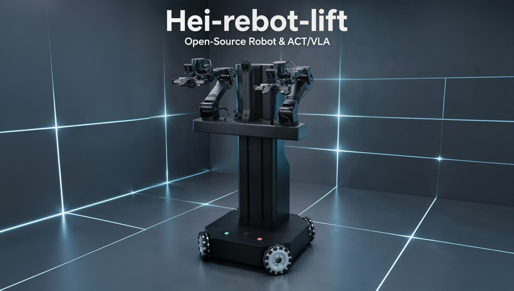
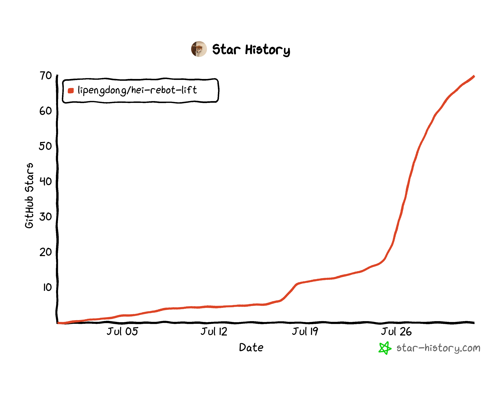

<h1 align="center">HEI ReBot Lift</h1>

<p align="center">
  
</p>

<p align="center">
  <a href="README.md"><b>English</b></a> <b>|</b>
  <a href="README_zh.md"><b>中文</b></a> <b>|</b>
  <a href="README_Fr.md"><b>français</b></a> <b>|</b>
  <a href="README_es.md"><b>Español</b></a>
</p>

<p align="center">
  <a href="https://github.com/lipengdong/hei-rebot-lift/stargazers">
    
  </a>
</p>

## 🚀 Descripción general

**HEI ReBot Lift** es un proyecto de **robot móvil con doble brazo y plataforma elevadora** para aprendizaje de IA encarnada, reproducción de hardware y validación en robot real. Su objetivo es **reducir la barrera para construir sistemas reales de aprendizaje robótico**. Sigue la idea de un **código abierto realmente reproducible**: además del código, organiza materiales de hardware, cableado, despliegue, teleoperación VR, grabación de datasets, entrenamiento ACT/VLA y rollout en robot real.

<p align="center">
  <b>🚀 Manipulación móvil de doble brazo</b> · <b>📖 Hardware + software abiertos</b> · <b>🤖 Compatible con LeRobot</b>
</p>

<p align="center">
  <a href="#-instalación-rápida">🚀 Instalación rápida</a> ·
  <a href="#-hardware">🦾 Hardware</a> ·
  <a href="#-flujo-de-arranque">🎮 Teleoperación VR</a> ·
  <a href="#-grabación-de-datos">📷 Datos</a> ·
  <a href="#-entrenamiento-act">🧠 ACT</a> ·
  <a href="#-entrenamiento-smolvla">✨ VLA</a>
</p>

## ✨ Características

<div align="center">

<table>
  <thead>
    <tr><th align="center">Icono</th><th align="center">Capacidad</th><th align="center">Descripción</th></tr>
  </thead>
  <tbody>
    <tr><td align="center">🦾</td><td align="center">Manipulación de doble brazo</td><td align="center">Brazos Damiao y pinzas para teleoperación, grabación y rollout</td></tr>
    <tr><td align="center">⬆️</td><td align="center">Plataforma elevadora</td><td align="center">Homing automático al iniciar; límite superior como <code>height.pos = 0</code></td></tr>
    <tr><td align="center">⭕</td><td align="center">Base omnidireccional</td><td align="center">Chasis omnidireccional de cuatro ruedas con control <code>x/y/theta</code></td></tr>
    <tr><td align="center">🎮</td><td align="center">Teleoperación VR</td><td align="center">Telegrip recibe datos VR; MuJoCo + Pinocchio/CasADi calculan IK</td></tr>
    <tr><td align="center">📷</td><td align="center">Tres cámaras</td><td align="center"><code>front</code>, <code>left_wrist</code> y <code>right_wrist</code></td></tr>
    <tr><td align="center">🧠</td><td align="center">Imitación / VLA</td><td align="center">Compatible con LeRobotDataset, ACT, SmolVLA y rollout real</td></tr>
  </tbody>
</table>


</div>

## 🤝 Obtén tu robot / Únete a la comunidad

Puedes reproducir tu propio **HEI ReBot Lift** usando los materiales de hardware, BOM, notas de cableado y documentación de despliegue del proyecto. También damos la bienvenida a constructores e investigadores interesados en manipulación móvil de doble brazo, teleoperación VR, recopilación de datos con LeRobot, entrenamiento ACT/VLA y despliegue en robot real.

<p align="center">
  <b>Comunidad WeChat / colaboración:</b> <code>hgm159951</code> &nbsp;&nbsp;|&nbsp;&nbsp;
  <b>Email:</b> <a href="mailto:hgm159951@163.com">hgm159951@163.com</a>
</p>

## 📁 Estructura del proyecto

```text
hei-rebot-lift/
├── README.md
├── README_zh.md
├── README_Fr.md
├── README_es.md
├── community/
├── hardware/
├── media/
├── docs/
└── software/
    └── lerobot-hei-rebot-lift/
```

El software ejecutable está en:

```bash
cd software/lerobot-hei-rebot-lift
```

## 🦾 Hardware

| Recurso | Archivo / Directorio | Descripción |
| --- | --- | --- |
| Guía de hardware | [hardware/README.md](hardware/README.md) | Índice, orden de reproducción y checklist de seguridad |
| BOM completo | [hardware/HEI_ReBot_Lift_BOM.md](hardware/HEI_ReBot_Lift_BOM.md) / [xlsx](hardware/HEI_ReBot_Lift_BOM.xlsx) | Lista principal de compra y preparación |
| Ensamblaje completo | [hardware/Hei_robot_lift.STEP](hardware/Hei_robot_lift.STEP) | Modelo STEP completo del robot |
| Piezas 3D | [hardware/3D_Printed_Parts/](hardware/3D_Printed_Parts/) | Archivos STL |
| Lista de piezas metálicas | [hardware/Metal_Parts/HEI_Metal_Body_Parts_List.xlsx](hardware/Metal_Parts/HEI_Metal_Body_Parts_List.xlsx) | Lista CNC / chapa metálica |
| CAD metálicos | [hardware/Metal_Parts/step/](hardware/Metal_Parts/step/) / [hardware/Metal_Parts/dwg/](hardware/Metal_Parts/dwg/) | Archivos STEP y DWG |

```text
Brazos: dos brazos, 7 motores Damiao por brazo. Articulaciones 1-3: DM4340P; articulaciones 4-6 y pinza: DM4310
Chasis: base móvil omnidireccional de cuatro ruedas, motores DM4310
Elevador: plataforma de husillo con motor DM4310, homing a height.pos = 0
Cámaras: front, left_wrist, right_wrist
Comunicación: ZMQ entre host del robot y cliente PC
Teleoperación: visor VR + controladores, Telegrip, MuJoCo, Pinocchio/CasADi
```

## ⚡ Instalación rápida

Crear el entorno LeRobot:

```bash
cd software/lerobot-hei-rebot-lift
conda create -n lerobot5 python=3.12 -y
conda activate lerobot5
pip install -e .
```

Crear el entorno VR/MuJoCo IK:

```bash
cd software/lerobot-hei-rebot-lift/examples/hei_rebot_lift/VR_mujoco_ik
conda env create -f environment.yml
```

Verificar Pinocchio + CasADi:

```bash
conda activate hei-rebot-vr
env -u LD_LIBRARY_PATH python -c "import pinocchio as pin; from pinocchio import casadi as cpin; print(pin.__version__); print('casadi binding ok')"
```

## 🔌 Mapeo de dispositivos

```text
/dev/hei_right_arm   Brazo derecho U2CAN
/dev/hei_left_arm    Brazo izquierdo U2CAN
/dev/hei_chassis     Chasis U2CAN
/dev/hei_lift        Motor elevador U2CAN
/dev/hei_lift_io     Puerto serie de finales de carrera
```

## 🎮 Flujo de arranque

En el robot:

```bash
cd software/lerobot-hei-rebot-lift
PYTHONPATH=src conda run --no-capture-output -n lerobot5 hei-rebot-lift-host
```

En el ordenador, iniciar Telegrip:

```bash
cd software/lerobot-hei-rebot-lift/examples/hei_rebot_lift/VR_mujoco_ik
./run_telegrip.sh
```

Iniciar MuJoCo IK:

```bash
cd software/lerobot-hei-rebot-lift/examples/hei_rebot_lift/VR_mujoco_ik
./run_mujoco_ik.sh
```

Prueba de teleoperación:

```bash
cd software/lerobot-hei-rebot-lift
PYTHONPATH=src conda run --no-capture-output -n lerobot5 python -u examples/hei_rebot_lift/teleoperate.py --remote-ip 192.168.31.127
```

## 📷 Grabación de datos

```bash
cd software/lerobot-hei-rebot-lift
PYTHONPATH=src conda run --no-capture-output -n lerobot5 python -u examples/hei_rebot_lift/record.py --repo-id HGM/hei_rebot_lift_task1 --remote-ip 192.168.31.127 --num-episodes 5 --episode-time-sec 120 --reset-time-sec 30 --task-description "Pick up the yellow block from the floor and put it on the table in front"
```

## 🧠 Entrenamiento ACT

```bash
cd software/lerobot-hei-rebot-lift
PYTHONPATH=src conda run --no-capture-output -n lerobot5 lerobot-train --dataset.repo_id=HGM/hei_rebot_lift_task1 --policy.type=act --policy.device=cuda --policy.push_to_hub=false --output_dir=outputs/train/act_hei_rebot_lift_task1 --job_name=act_hei_rebot_lift_task1 --batch_size=8 --steps=10000 --save_freq=10000 --log_freq=200 --num_workers=4 --wandb.enable=false
```

## ✨ Entrenamiento SmolVLA

```bash
cd software/lerobot-hei-rebot-lift
PYTHONPATH=src conda run --no-capture-output -n lerobot5 lerobot-train --dataset.repo_id=HGM/hei_rebot_lift_task1 --policy.type=smolvla --policy.device=cuda --policy.push_to_hub=false --output_dir=outputs/train/smolvla_hei_rebot_lift_task1 --job_name=smolvla_hei_rebot_lift_task1 --batch_size=1 --steps=1000 --save_freq=1000 --log_freq=50 --num_workers=2 --wandb.enable=false
```

## 🤖 Rollout en robot real

```bash
cd software/lerobot-hei-rebot-lift
PYTHONPATH=src conda run --no-capture-output -n lerobot5 python -u examples/hei_rebot_lift/rollout.py --model-id outputs/train/act_hei_rebot_lift_task1/checkpoints/010000/pretrained_model --task "Pick up the yellow block from the floor and put it on the table in front" --duration-sec 30 --inference sync
```

## ⭐ Star History

<p align="center">
  <a href="https://www.star-history.com/?repos=lipengdong%2Fhei-rebot-lift&type=date&legend=top-left">
    
  </a>
</p>

## 🙏 Referencias

- [Seeed reBot-DevArm](https://github.com/Seeed-Projects/reBot-DevArm)
- [LeRobot](https://github.com/huggingface/lerobot)
